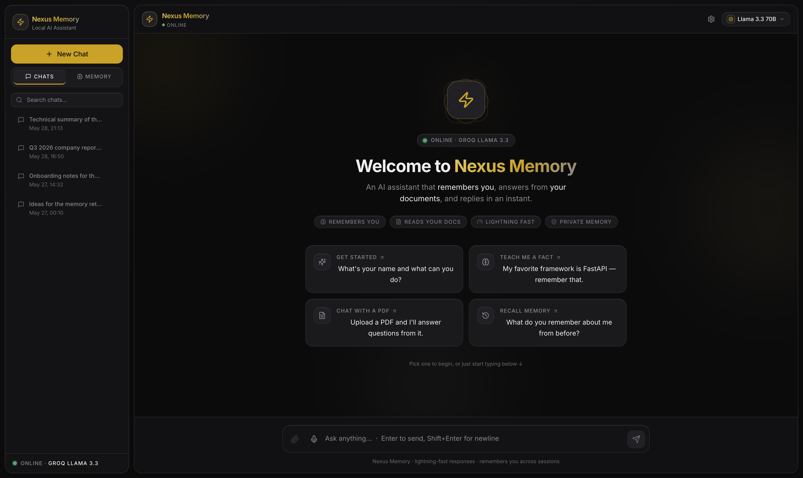
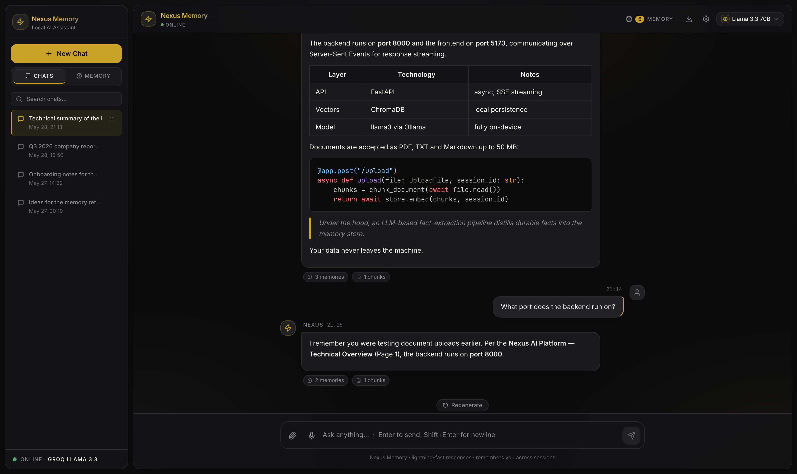
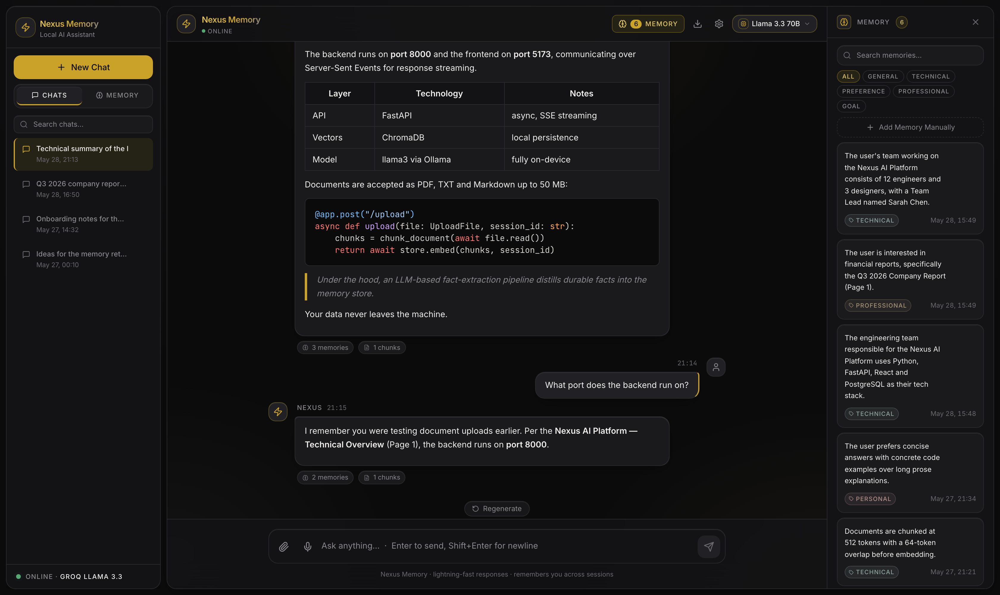
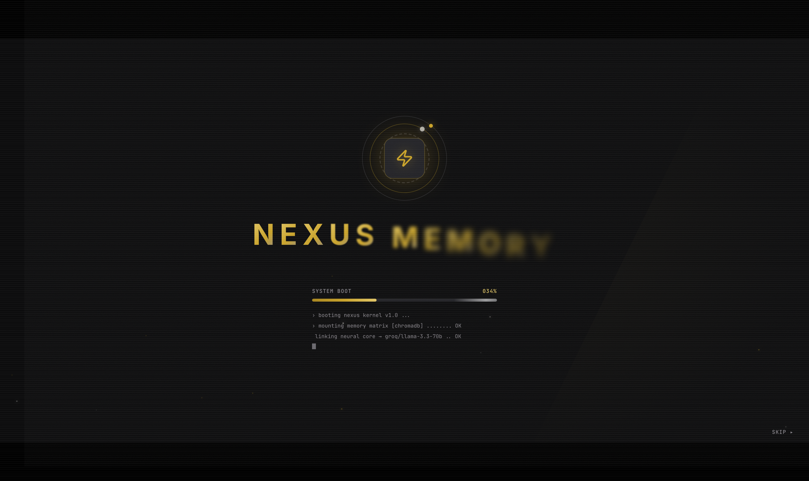

# Nexus Memory

> A premium AI assistant that **remembers you across sessions**, answers questions from **your documents**, and replies in an instant — powered by **Groq**, with durable **Supabase** storage.

<div align="center">

[](https://python.org)
[](https://fastapi.tiangolo.com)
[](https://react.dev)
[](https://groq.com)
[](https://langchain.com)
[](https://supabase.com)
[](LICENSE)

</div>

---

## Screenshots

| | |
| --- | --- |
|  |  |
| **Welcome** — suggestion cards and ambient backdrop | **Chat** — streaming replies, tables, highlighted code, memory/source chips |
|  |  |
| **Memory Store** — searchable, editable, category-filtered | **Boot sequence** — cinematic startup |

---

## What is Nexus Memory?

Nexus Memory is a full-stack AI assistant focused on **long-term memory**. Unlike a generic chatbot it:

- **Remembers facts about you** across every conversation (semantic memory, scoped per user)
- **Reads your documents** (PDF, DOCX, CSV, TXT, MD) and answers with **inline citations** (RAG)
- **Streams replies in ~1s** via Groq's LPU inference (Llama 3.3 70B)
- **Persists everything** in Supabase (Postgres + pgvector) — survives restarts & works across devices
- Ships with a **premium, cinematic UI** — voice I/O, code highlighting, personas, and more

---

## Features

### Persistent memory (the core)
- **Cross-session recall** — memories are scoped per user (`client_id`) and recalled in every chat
- **LLM extraction** — facts are extracted with category + confidence, then **de-duplicated** on write
- **Provenance** — each memory shows the message it came from
- **Editable memory panel** — inline edit, search, and category filters
- Backed by **Postgres** (facts) + **pgvector** (semantic search)

### Document chat (RAG)
- Upload **PDF, DOCX, CSV, TXT, MD**
- Chunking → embeddings (`all-MiniLM-L6-v2`) → pgvector
- **Inline citations** — see exactly which source/page answered
- MMR retrieval (with similarity fallback)

### Premium chat UX
- **Streaming** replies with a natural **typewriter** reveal
- **Stop / Regenerate / Edit-and-resend**
- **Syntax-highlighted code blocks** with copy buttons
- **Slash commands** — `/summarize`, `/translate`, `/clear`, `/help`
- **Search conversations**, **export to Markdown**
- **Conversation summarization** keeps long chats coherent

### Voice & settings
- **Voice input** (speech-to-text) and **read-aloud** replies (TTS) + auto-speak
- **Settings**: temperature, **persona presets** (Concise / Mentor / Creative) + custom system prompt

### Design — "Graphite & Champagne"
- A neutral graphite base (`#0B0B0C` → `#212125`) with a single champagne-gold accent (`#C9A227`)
- Gold is treated as **jewelry, not fabric** — it is reserved for the primary action, focus rings and active states, so the interface separates by tone rather than hue
- Surfaces are raised by an **inset top hairline** (light-on-edge) rather than drop shadows, on a three-step elevation ladder
- **WCAG AA** across the board: body text is checked against every surface it sits on, and near-black ink (never white) is used on gold fills
- Cinematic boot sequence, floating rounded panels, ambient backdrops — tuned to stay **smooth** (GPU-composited, no scroll jank)

---

## Architecture

```text
┌──────────────────────────────────────────────────────────────┐
│                  FRONTEND  (React + Vite + Tailwind)          │
│   ChatWindow · MemoryPanel · Sidebar · Settings · Voice       │
└───────────────────────────┬──────────────────────────────────┘
                            │  HTTP / SSE  (X-Client-Id)
                            ▼
┌──────────────────────────────────────────────────────────────┐
│                   BACKEND  (FastAPI + LangChain)              │
│   /chat (SSE)   /upload   /memory   /health                   │
│                                                               │
│   ┌──────────────┐   ┌───────────────┐   ┌────────────────┐   │
│   │ Groq LLM     │   │ Local CPU      │   │  Supabase      │   │
│   │ Llama 3.3 70B│   │ embeddings     │   │  Postgres +    │   │
│   │ (streaming)  │   │ (MiniLM-L6)    │   │  pgvector      │   │
│   └──────────────┘   └───────────────┘   └────────────────┘   │
└──────────────────────────────────────────────────────────────┘
```

When `DATABASE_URL` is **not** set, the backend falls back to local **SQLite + ChromaDB** for zero-config local dev.

---

## Tech Stack

| Layer              | Technology                          |
| ------------------ | ----------------------------------- |
| Frontend           | React 18 + Vite + TailwindCSS       |
| Animation          | Framer Motion                       |
| Markdown / code    | react-markdown + rehype-highlight   |
| Backend            | FastAPI (async, SSE streaming)      |
| LLM                | Groq — `llama-3.3-70b-versatile`    |
| AI framework       | LangChain                           |
| Embeddings         | sentence-transformers `all-MiniLM-L6-v2` |
| Database           | Supabase **Postgres** (SQLite fallback) |
| Vector store       | **pgvector** (ChromaDB fallback)    |
| Docs               | PyPDF · python-docx · CSV           |

---

## Configuration (environment variables)

| Variable | Required | Description |
| --- | --- | --- |
| `GROQ_API_KEY` | Required | Free key from [console.groq.com](https://console.groq.com) |
| `DATABASE_URL` | Recommended | Supabase Postgres **session-pooler** URI. Unset → local SQLite. |
| `GROQ_MODEL` | optional | Defaults to `llama-3.3-70b-versatile` |
| `CORS_ORIGINS` | optional | Comma-separated allowed origins (defaults to `*`) |

> For Supabase: use the **Session pooler** connection string (IPv4), enable the `vector` extension, and URL-encode special characters in the password (`@` → `%40`).

---

## Run locally

### Backend
```bash
python3 -m venv venv && source venv/bin/activate   # Windows: venv\Scripts\activate
pip install -r requirements.txt
export GROQ_API_KEY=your_key        # Windows: $env:GROQ_API_KEY="your_key"
cd backend && uvicorn main:app --reload --port 8000
```
No `DATABASE_URL` → uses local SQLite + ChromaDB automatically.

### Frontend
```bash
cd frontend
npm install
npm run dev          # http://localhost:5173
```
Set `VITE_API_URL` in `frontend/.env` to point at a deployed backend (defaults to `http://localhost:8000`).

---

## Deploy (Hugging Face Space + Supabase)

The backend ships as a **Docker Space**:
1. Create a **Docker** Space and push this repo (the `Dockerfile` + `start.sh` run FastAPI on port 7860).
2. Add Space secrets: **`GROQ_API_KEY`**, **`DATABASE_URL`** (Supabase session-pooler URI).
3. Deploy the **frontend** (Vite static build) to Vercel/Netlify with `VITE_API_URL` = your Space URL.

See `HF_DEPLOY.md` for the step-by-step.

---

## API Reference (selected)

| Method | Endpoint | Description |
| --- | --- | --- |
| POST | `/chat` | Send a message, returns an SSE stream (tokens + citations) |
| GET | `/chat/sessions` | List this client's sessions |
| POST | `/upload` | Upload + index a document |
| GET/POST/PUT/DELETE | `/memory…` | Manage memories (client-scoped) |
| GET | `/health` | API + LLM status |

All requests carry an `X-Client-Id` header that scopes data per browser/user.

---

## License

MIT — see [LICENSE](LICENSE).

<div align="center">
Fast, memory-driven AI.
</div>
