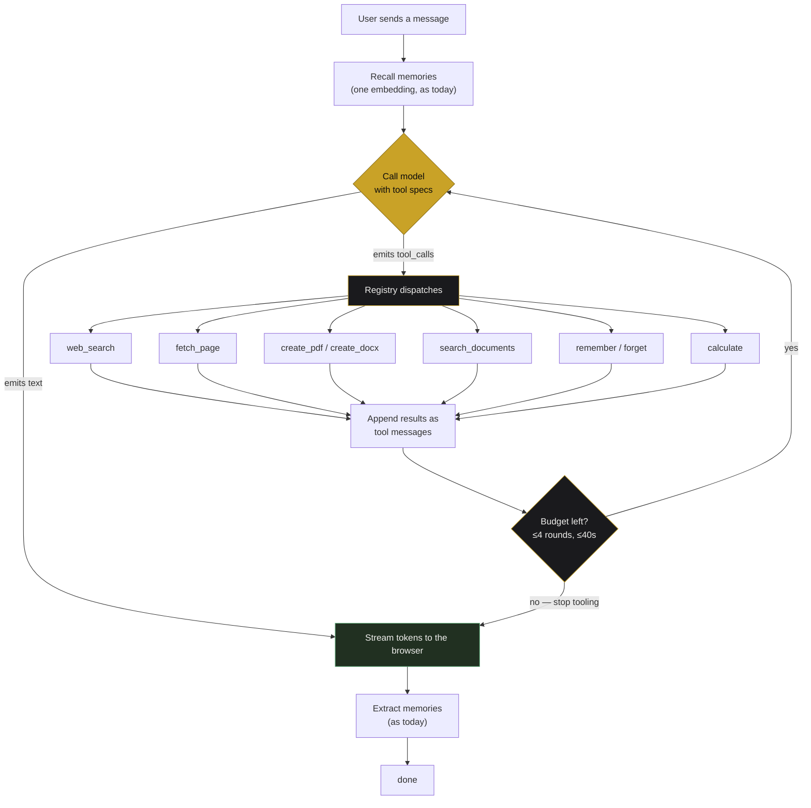
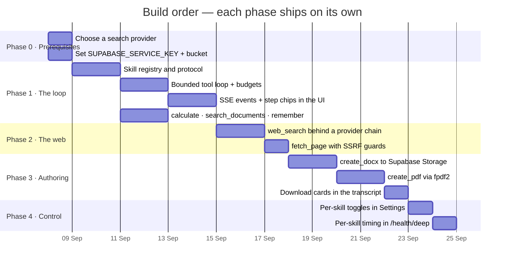

# Giving Nexus Memory skills

A plan for turning Nexus from an assistant that *reads* into one that *acts* —
searching the web, reading pages, and producing PDF and Word files you can
download.

Status: proposal. Nothing here is built yet.
Written 5 September 2026, against the deployment at `nexus-memory-ten.vercel.app`.

---

## 1. Where we are

Nexus today does three things, all of them passive:

| Capability | How it works now |
| --- | --- |
| Long-term memory | Facts extracted from a reply *after* it is sent, embedded into pgvector, recalled on the next turn |
| Document chat | Every uploaded document is searched on **every** turn, and the top passages are stuffed into the prompt |
| Chat | One model call per turn: build prompt → stream tokens → done |

The shape of that last row is the constraint. One call in, one answer out. The
model cannot look anything up, cannot check its arithmetic, and cannot hand you
a file. Everything it knows has to already be in the prompt when the call
starts.

**The unlock:** all five models your Ollama Cloud key can reach —
`gemma4:31b`, `gpt-oss:120b`, `gpt-oss:20b`, `nemotron-3-nano:30b`,
`nemotron-3-super` — return well-formed OpenAI-style `tool_calls`. Verified
against the live API on 5 Sep 2026. No model change is needed.

---

## 2. The architectural change

One prompt call becomes a bounded loop. The model is offered a set of tools; if
it asks for one, we run it, hand back the result, and let it continue.



Three things make this safe on Vercel:

- **A step cap.** Four tool rounds maximum. Beyond that the model is told to
  answer with what it has.
- **A wall-clock budget.** Vercel kills the function at 60s. At 40s elapsed the
  tools are withdrawn and the model is asked to conclude.
- **Nothing blocks the first token when no tool is called.** A plain question
  costs exactly what it costs today (~1s), because the loop exits on the first
  pass.

### New events on the wire

The SSE stream currently emits `metadata`, `token`, `done`, `error`. Skills add
three, so the interface can narrate what is happening instead of showing an
idle spinner for eight seconds:

| Event | Payload | What the UI does |
| --- | --- | --- |
| `tool_call` | `{name, args}` | Shows a step chip: "Searching the web — *pune weather*" |
| `tool_result` | `{name, ok, summary}` | Marks the step done, or shows why it failed |
| `artifact` | `{filename, url, bytes}` | Renders a download card under the reply |

---

## 3. The skills

Ordered by value per unit of risk. The first three need no new accounts and no
new dependencies at all.

| # | Skill | What it does | New dependency | Needs a key |
| --- | --- | --- | --- | --- |
| 1 | `calculate` | Safe arithmetic via an AST walker — no `eval` | none | no |
| 2 | `search_documents` | Exposes the existing RAG retriever as a tool | none | no |
| 3 | `remember` / `forget` | Explicit memory writes, so "forget that" works | none | no |
| 4 | `web_search` | Current information from the open web | search SDK (~2 MB) | **yes** |
| 5 | `fetch_page` | Reads one URL and extracts its text | `beautifulsoup4` (~1 MB, `lxml` is already bundled) | no |
| 6 | `create_pdf` | Markdown → PDF, stored and returned as a link | `fpdf2` (~36 MB with Pillow + fontTools) | storage key |
| 7 | `create_docx` | Markdown → Word document | none — `python-docx` is already a dependency | storage key |

### Notes that change the design

**`search_documents` makes Nexus faster, not slower.** Today every turn
searches every uploaded document whether or not the question is about them. As
a tool, the model only reaches for documents when they are relevant — so
"what's 12% of 4,300?" stops paying for a vector search.

**`remember` / `forget` closes a real gap.** Memory extraction currently runs
after the fact and cannot be corrected in conversation. Saying "actually, forget
that I use FastAPI" does nothing today.

**PDF generation is the only heavy item.** `fpdf2` itself is 2.9 MB; its
dependencies (Pillow, fontTools) are the other 33 MB. Options if the bundle gets
tight are in §5.

**Everything listed ships a pure-Python `py3` wheel**, which matters because
Vercel forces CPython 3.14 and ignores `.python-version` — the trap that already
cost us one round of failed deploys.

---

## 4. Where the code goes

```
backend/
  skills/
    __init__.py        registry: collects SPECs, dispatches by name
    base.py            Skill protocol — SPEC (JSON schema) + run()
    calculate.py
    documents.py       search_documents
    memory_tools.py    remember, forget
    web.py             web_search, fetch_page
    authoring.py       create_pdf, create_docx
  services/
    tool_loop.py       the bounded loop, budget accounting, SSE emission
    storage.py         (exists) — reused to store generated files
```

A skill is one module exposing two things:

```python
SPEC = {
    "type": "function",
    "function": {
        "name": "web_search",
        "description": "Search the web for current information.",
        "parameters": {...},   # JSON schema
    },
}

async def run(query: str) -> dict:
    """Returns {'ok': bool, 'summary': str, 'data': ...}."""
```

The registry is the only thing `chat.py` imports, and each skill can be
disabled by config — so a missing search key removes `web_search` from the
offered tools rather than failing at call time.

---

## 5. Constraints this has to live inside

| Constraint | Limit | Where we are | Impact |
| --- | --- | --- | --- |
| Vercel function bundle | 250 MB | 144 MB today, ~185 MB with every skill | Fits, with ~65 MB spare |
| Vercel function duration | 60 s | ~1 s warm, 4.2 s cold | Tool loop needs the 40 s budget and the 4-round cap |
| Python runtime | 3.14, not overridable | — | Every new pin must ship a cp314 or `py3` wheel |
| Ollama free tier | 6 models | all support tools | No plan upgrade needed |

If the bundle ever gets tight, the escape route is to drop `create_pdf` and
render PDFs from the DOCX path instead, or move authoring to a second Vercel
function with its own dependency set — `create_pdf` does not need SQLAlchemy,
langchain, or psycopg2.

---

## 6. Phasing



### Acceptance criteria

**Phase 1 is done when** a question needing no tools still streams its first
token in about a second, `calculate` answers "what is 12% of 4,300" correctly,
"forget that I use FastAPI" removes the entry from the memory panel, and the
transcript shows a step chip while a tool runs.

**Phase 2 is done when** "what happened in the news today" returns something
dated today with a source link, `fetch_page` refuses `localhost` and private
address ranges, and a search outage degrades to a normal answer rather than an
error.

**Phase 3 is done when** "write that up as a PDF" produces a downloadable file
whose link survives a page reload, and the same request works for `.docx`.

**Phase 4 is done when** each skill can be switched off from Settings and
`/health/deep` reports per-skill availability and last latency.

---

## 7. Decisions needed before Phase 1

1. **Which web search provider.** Tavily is built for LLM use and returns clean
   extracts (1,000 searches/month free). Brave gives 2,000/month free but raw
   results need more post-processing. DuckDuckGo needs no key at all but is
   rate-limited and unofficial. *Recommendation: Tavily, with the keyless
   DuckDuckGo path as the fallback so the skill works before any key is set.*

2. **`SUPABASE_SERVICE_KEY` is not currently set on Vercel.** Generated files
   need somewhere durable to live; the Storage code already exists and is
   gated on this key. Without it, files would only survive in `/tmp` until the
   function instance recycles. *Recommendation: set it, and create the
   `nexus-uploads` bucket if it does not exist.*

3. **Which model handles tool turns.** `gemma4:31b` is the fastest and handles
   single tool calls well. `gpt-oss:120b` is stronger at multi-step reasoning
   but streams a reasoning preamble first, which delays the visible answer.
   *Recommendation: keep `gemma4:31b` as default, and let the picker choose.*

---

## 8. Risks

| Risk | Mitigation |
| --- | --- |
| A tool loop blows the 60 s Vercel limit | 4-round cap and a 40 s budget, after which tools are withdrawn |
| The model calls tools it does not need, adding latency | Tool descriptions state when *not* to use them; `search_documents` is only offered when the session has documents |
| `fetch_page` is pointed at internal addresses (SSRF) | Allow only http/https, resolve first and reject private and loopback ranges, cap response size and time |
| Search API quota is exhausted mid-month | Provider chain falls back to keyless search, then degrades to answering without it |
| Generated files leak between users | Object keys are prefixed with the `client_id` that already scopes chats and memories; links are short-lived signed URLs |
| Bundle grows past 250 MB | Authoring skills split into their own function (they need none of the DB stack) |

---

## 9. What this does not cover

Deliberately out of scope for now: running code in a sandbox, generating images
or charts (matplotlib alone would nearly double the bundle), scheduled or
background jobs, and multi-user accounts. Each is worth its own plan.
